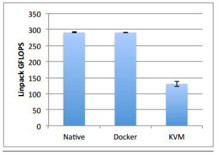
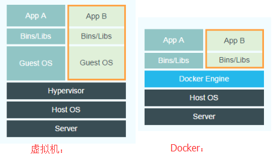

# 二、Docker概述

## 1、什么是docker

* 基于lxc（linux container）内核虚拟化技术的开源应用容器引擎。

## 2、docker 优缺点

优点

```@text
* 持续集成
  轻量级容器对项目快速构建，环境打包，发布流程。

* 版本控制
  每个镜像就是一个版本，方便管理

* 可移植性
  可移动到任意一台docker主机上，不必关注底层系统

* 标准化
  环境，依赖，配置不变。

*隔离性和安全
  > 进程间相互隔离，一个容器故障不会影响其他容器.

* 性能
- 资源占用少
- 秒级启动
- 不需要考虑cpu是否支持虚拟化，容器共享宿主机内核。
- 没有hypervisor层开销，性能接近物理机。
    > 根据IBM发表的论文给出的数据进行分析。以下的数据均是在IBM x3650 M4服务器测得，其主要的硬件参数是：
    （1）2颗英特尔xeon E5-2655 处理器，主频2.4-3.0 GHz。每颗处理器有8个核，因此总共有16个核。
    （2）256 GB RAM.
    在测试中是通过运算Linpack程序来获得计算能力数据的。结果如下图所示：
```



```@text
图中从左往右分别是物理机、docker和虚拟机的计算能力数据。可见docker相对于物理机其计算能力几乎没有损耗，而虚拟机对比物理机则有着非常明显的损耗。虚拟机的计算能力损耗在50%左右。
为什么会有这么大的性能损耗呢？一方面是因为虚拟机增加了一层虚拟硬件层，运行在虚拟机上的应用程序在进行数值计算时是运行在Hypervisor虚拟的CPU上的；另外一方面是由于计算程序本身的特性导致的差异。虚拟机虚拟的cpu架构不同于实际cpu架构，数值计算程序一般针对特定的cpu架构有一定的优化措施，虚拟化使这些措施作废，甚至起到反效果。比如对于本次实验的平台，实际的CPU架构是2块物理CPU，每块CPU拥有16个核，共32个核，采用的是NUMA架构；而虚拟机则将CPU虚拟化成一块拥有32个核的CPU。这就导致了计算程序在进行计算时无法根据实际的CPU架构进行优化，大大减低了计算效率。
```

缺点

```@text
1.资源隔离方面不如虚拟机，docker是利用cgroup实现资源限制的，只能限制资源消耗的最大值，而不能隔绝其他程序占用自己的资源。
2.安全性问题。docker目前并不能分辨具体执行指令的用户，只要一个用户拥有执行docker的权限，那么他就可以对docker的容器进行所有操作，不管该容器是否是由该用户创建。比如A和B都拥有执行docker的权限，由于docker的server端并不会具体判断docker cline是由哪个用户发起的，A可以删除B创建的容器，存在一定的安全风险。
3.docker目前还在版本的快速更新中，细节功能调整比较大。一些核心模块依赖于高版本内核，存在版本兼容问题
```

## 3、虚拟机和docker区别

* 

* docker Engine :可以简单看成对Linux的NameSpace、Cgroup、镜像管理文件系统操作的封装。docker并没有和虚拟机一样利用一个完全独立的Guest OS实现环境隔离，它利用的是目前Linux内核本身支持的容器方式实现资源和环境隔离。简单的说，docker利用namespace实现系统环境的隔离；利用Cgroup实现资源限制；利用镜像实现根目录环境的隔离。

* Hypervisor: 虚拟机实现资源隔离的方法是利用独立的OS，并利用Hypervisor虚拟化CPU、内存、IO设备等实现的。例如，为了虚拟CPU，Hypervisor会为每个虚拟的CPU创建一个数据结构，模拟CPU的全部寄存器的值，在适当的时候跟踪并修改这些值。需要指出的是在大多数情况下，虚拟机软件代码是直接跑在硬件上的，而不需要Hypervisor介入。只有在一些权限高的请求下，Guest OS需要运行内核态修改CPU的寄存器数据，Hypervisor会介入，修改并维护虚拟的CPU状态。Hypervisor虚拟化内存的方法是创建一个shadow page table。正常的情况下，一个page table可以用来实现从虚拟内存到物理内存的翻译。在虚拟化的情况下，由于所谓的物理内存仍然是虚拟的，因此shadow page table就要做到：虚拟内存->虚拟的物理内存->真正的物理内存。对于IO设备虚拟化，当Hypervisor接到page fault，并发现实际上虚拟的物理内存地址对应的是一个I/O设备，Hypervisor就用软件模拟这个设备的工作情况，并返回。比如当CPU想要写磁盘时，Hypervisor就把相应的数据写到一个host OS的文件上，这个文件实际上就模拟了虚拟的磁盘。

* 结论：
> - docker有着比虚拟机更少的抽象层。由于docker不需要Hypervisor实现硬件资源虚拟化，运行在docker容器上的程序直接使用的都是实际物理机的硬件资源。因此在CPU、内存利用率上docker将会在效率上有优势，具体的效率对比在下几个小节里给出。在IO设备虚拟化上，docker的镜像管理有多种方案，比如利用Aufs文件系统或者Device Mapper实现docker的文件管理，各种实现方案的效率略有不同。
> - docker利用的是宿主机的内核，而不需要Guest OS。因此，当新建一个容器时，docker不需要和虚拟机一样重新加载一个操作系统内核。我们知道，引导、加载操作系统内核是一个比较费时费资源的过程，当新建一个虚拟机时，虚拟机软件需要加载Guest OS，这个新建过程是分钟级别的。而docker由于直接利用宿主机的操作系统，则省略了这个过程，因此新建一个docker容器只需要几秒钟。另外，现代操作系统是复杂的系统，在一台物理机上新增加一个操作系统的资源开销是比较大的，因此，docker对比虚拟机在资源消耗上也占有比较大的优势。事实上，在一台物理机上我们可以很容易建立成百上千的容器，而只能建立几个虚拟机。

## 4、docker架构

* c/s架构

* cgroups（control groups）
> linux内核提供的进程资源限制机制

* namespace:
> UTS:
>> hostname
>> domain
>
> IPC:
>> 信号
>>
>> 消息队列
>>
>> 共享内存
>
> PID：
>
> network：
>> ip
>>
>> port
>
> mount：
>
> user：
>> 用户
>>
>> 用户组
>

* 文件系统：

* Docker模型的核心部分是基于图像的分层图像和​​容器的高效使用。为了实现这个Docker，很大程度上依赖于内核中的各种文件系统功能。

* 存储后端Docker中文件系统的基础是存储后端抽象。存储后端允许您存储一组以独特名称寻址的图层。每一层都是一个文件系统树，可以在需要时加载和修改。新的图层可以从头开始，但也可以使用指定的父级创建。这意味着，他们开始与父层相同的内容，但随着时间的推移，他们可能会发生分歧。这通常通过某种形式的写入时拷贝（copy-on-write）在后端实现，以使创建操作变得快速。一些后端也有额外的操作，可以有效地计算层之间的差异。这些操作都具有回退实现，但是它们可能会比较慢，因为它们必须比较图层中的所有文件。

* 基于图层抽象，Docker实现了图像和容器的高级概念。系统上的每个Docker映像都存储为一个图层，父图像是父图像的图层。要创建这样的图像，会创建一个新图层（基于正确的父级），然后将该图像中的更改应用到新安装的文件系统。容器有点复杂。每个容器都有两层，一层（称为init层），它基于一个图像层和一个包含实际容器内容的子层。init层包含一些必须始终存在于Docker容器中的文件（例如/.dockerinit)，提交一个容器（从而创建一个映像）涉及到从init层到容器层的所有更改，并将这些更改应用到基于相同的图像使用的容器。

* docker所支持的文件系统有以下几种：Aufs、devicemapper、btrfs和Vfs，其中前三种是联合文件统，可以支持分层，VFS 不支持分层。平时用的最多的是aufs 和devicemapper。

* UFS：unionfs 联合文件系统，支持将不同位置的目录挂载到同一虚拟文件系统。形成一种分层模型：成员目录称为虚拟文件系统的一个分支（branch）

> aufs后端 （ubuntu,debain）
>> AUFS：advanced multi layered unification filesystem 直译过来就是高级分层联合文件系统，做为一种Union FS ，它支持将不同的目录挂载到同一个虚拟文件系统下。AUFS又叫Another UnionFS，后来叫Alternative UnionFS，后来可能觉得不够霸气，叫成Advance UnionFS.把一张CD/DVD和一个硬盘目录给联合 mount在一起，然后，你就可以对这个只读的CD/DVD上的文件进行修改（修改的文件存于硬盘上的目录里）。
>> aufs后端使用aufs union文件系统。上游内核和大多数发行版（包括来自Red Hat的任何发行版）都不支持此功能，因此不建议将其作为生产文件系统。它是Docker的原始后端，通常在基于Ubuntu的发行版上使用。后台将每个图层存储为常规目录，包含常规文件和特殊的aufs元数据。这就弥补了该层独有的所有文件，以及有关从前一层删除哪些文件的信息。然后，它依靠aufs文件系统将所有图层合并为一个安装点。对此挂载点的任何更改都会进入最上层。
>> image layers的内容都存储在Docker hosts filesystem的/var/lib/docker/aufs/diff目录下。而/var/lib/docker/aufs/layers目录则存储着image layer如何堆栈这些layer的metadata。

```bash

#可以从/sys/fs/aufs/si_[id]目录下查看aufs的mount的情况： 最高层读写，其他只读.
cat /sys/fs/aufs/si_b71b209f85ff8e75/*

/var/lib/docker/aufs/diff/87315f1367e5703f599168d1e17528a0500bd2e2df7d2fe2aaf9595f3697dbd7=rw

/var/lib/docker/aufs/diff/87315f1367e5703f599168d1e17528a0500bd2e2df7d2fe2aaf9595f3697dbd7-init=ro+wh

/var/lib/docker/aufs/diff/d0955f21bf24f5bfffd32d2d0bb669d0564701c271bc3dfc64cfc5adfdec2d07=ro+wh

/var/lib/docker/aufs/diff/9fec74352904baf5ab5237caa39a84b0af5c593dc7cc08839e2ba65193024507=ro+wh

/var/lib/docker/aufs/diff/a1a958a248181c9aa6413848cd67646e5afb9797f1a3da5995c7a636f050f537=ro+wh

/var/lib/docker/aufs/diff/f3c84ac3a0533f691c9fea4cc2ceaaf43baec22bf8d6a479e069f6d814be9b86=ro+wh

/var/lib/docker/aufs/diff/511136ea3c5a64f264b78b5433614aec563103b4d4702f3ba7d4d2698e22c158=ro+wh
```

> devicemapper后端 （centos,fedora）
>> devicemapper后端使用设备映射精简配置模块（dm-thinp）来实现图层。``Device-mapper是LVM2逻辑卷系统的核心部分，所以这是一个块级的写入时复制系统。``精简配置模块需要两个块设备（数据和元数据设备），并创建一个可用于创建其他块设备的空间池。这样的块设备被精简地配置，意味着它们开始是空的，未被使用的部分不被分配。另外，可以进行设备的写入时复制快照，生成新的设备。首次启动时，Docker会在精简池中创建一个基础设备，其中包含一个空的ext4文件系统。所有其他图层都是（直接或间接）此基础图层的快照。``文件系统有一个固定的大小，这意味着所有的图像和容器都有一个最大的大小。默认情况下，这个大小是10GB，尽管由于精简配置，每个设备往往只使用池中较少的空间。``为了建立精简池，你需要两个块设备，这并不总是用户想要处理的东西。因此，默认情况下，Docker会在/var/lib/docker/devicemapper/devicemapper被调用的内部创建两个常规文件data， metadata并使用loopback为精简池创建这些文件的 块设备。这些文件默认为100GB（数据）和2GB（元数据），但是它们是稀疏的，意味着未使用的块没有被映射，因此不占用主机文件系统上的空间。此外，还有一个外部文件（/var/lib/docker/devicemapper/devicemapper/json），其中包含从Docker图层名称到精简池标识的映射。环回设置使得在任何机器上开始使用docker非常容易，但是它不是使用devicemapper最有效的方式。在生产服务器上，建议您将docker精简池设置为使用实际块设备。为获得最佳性能，元数据设备应位于SSD驱动器上，或至少与数据设备位于不同的主轴上。为了支持系统上的多个Docker实例，精简池将被命名为docker-0:33-19478248-pool，其中0:30部分是次要/主要设备nr，并且19478248是/ var / lib / docker / devicemapper目录的inode编号。相同的前缀用于实际的精简设备。
> btrfs后端
>> brtfs后端需要/var/lib/docker位于btrfs文件系统上，并使用文件系统级快照来实现图层。每个图层都作为btrfs子卷存储在内部， /var/lib/docker/btrfs/subvolumes并作为父子卷的快照（如果有）启动。
>> ``这个后端是非常快的``，但是btrfs仍然是成熟的，不被认为是生产准备繁重的写入负载。为了限制文件系统损坏的影响，建议在系统的其他文件系统上安装/ var / lib / docker。您还需要/var/lib/docker/vfs/在标准XFS或EXT4文件系统上安装卷目录，以确保容器数据受到保护。
> vfs后端
>> vfs后端是一个非常简单的后备，没有写时复制的支持。每一层只是一个单独的目录。基于另一个图层创建一个新的图层是通过将基础图层的深层复制到一个新的目录中完成的。``由于这个后端没有共享磁盘空间的使用，而且由于创建一个新层是一个缓慢的操作，所以这不是一个非常实用的后端。``但是，它仍然有其用途，例如验证其他后端，或者如果您需要一个超级健壮（如果缓慢）的后端，无处不在。
> 比较后端
>> ``除vfs之外的所有后端共享基本映像之间的磁盘空间。``但是，他们在不同层面上工作，所以行为有所不同。``devicemapper和btrfs都在块级别上共享数据，所以文件中的单个更改只会导致包含该字节的块被复制。``然而，``aufs后端在文件级别上工作，所以对文件的任何改变意味着整个文件将被复制到顶层，然后在那里改变。这里的确切行为取决于应用程序的写入行为。``但是，``容器内的任何类型的写入重负载（例如数据库或大型日志）通常都应该对卷执行。卷是安装到容器中的主机的普通目录，这意味着它不具有存储后端可能具有的开销``。这也意味着，如果更新映像，或者如果要从多个并发容器访问相同的数据，则可以轻松访问新容器中的数据。

### 参考：

`http://blog.csdn.net/cbl709/article/details/43955687`

`http://www.projectatomic.io/docs/filesystems/`
