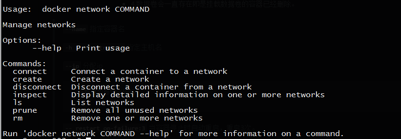
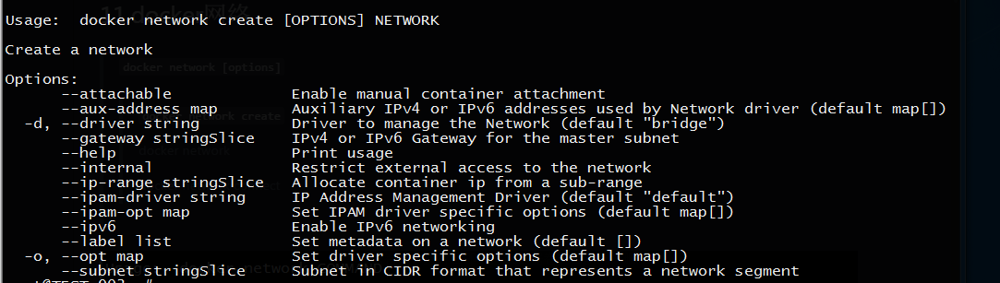
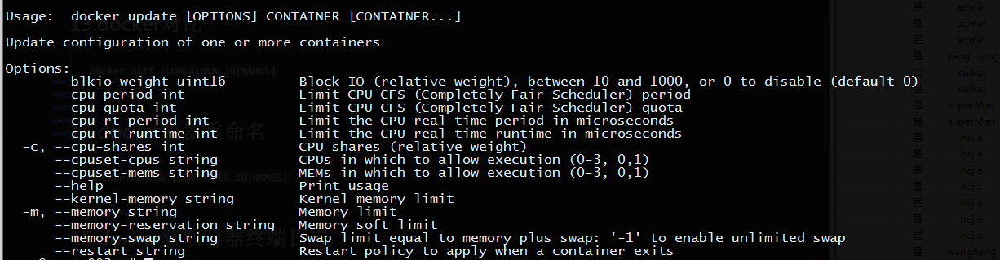
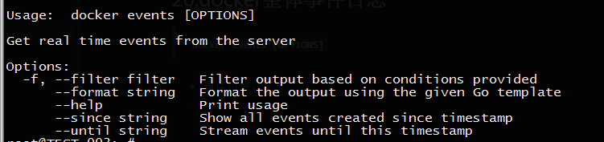

# 三、docker 容器管理（常用命令篇）

``docker --help`` ：查看帮助
> [``man docker``](./man/dockerman.md)

## 1.获取docker镜像
> ``docker search [image name]``,搜索相关镜像。

>> 如果下载镜像速度慢，可以考虑更换源。

>> ``curl -sSL https://get.daocloud.io/daotools/set_mirror.sh |sh -s http://04be47cf.m.daocloud.io``

> ``docker pull [image name]``,下载指定镜像。

## 2.查看本地镜像
>  ``docker images``

## 3.创建|启动容器(docker create --help|docker run --help)
> [``man docker run``](./man/dockerrunman.md)

* docker create 创建后不会启动
> ``docker create [OPTIONS] IMAGE [COMMAND] [ARG...]``

* docker run 创建后启动容器
> ``docker run [OPTIONS] IMAGE [COMMAND] [ARG...]``

* OPTIONS 容器的常用参数 (docker create 和docker run 创建时参数相同。)

  - 数据持久化
    - 数据卷（将外部存储挂载到容器内。
      - 相当于nfs挂载的效果,可以多容器共享使用。

  >  ``-v`` ``--mount`` (最初，-v或--volume用标志独立的容器和--mount用于群服务标志。但是，从Docker 17.06开始，您也可以使用--mount独立的容器。一般来说， --mount更明确和详细。最大的区别在于，-v 语法将所有选项组合在一个字段中，而--mount 语法将它们分开。以下是每个标志的语法比较。提示：新用户应使用--mount语法。有经验的用户可能更熟悉-v或--volume语法，但鼓励使用--mount，因为研究表明，它更容易使用。``如果您需要指定音量驱动程序选项，则必须使用--mount。``)
    >> ``docker run -itd -v /data:/home [image name]``

  > ``-itd`` 常用
    >> ``-i (interactive)`` 开启容器标准输入（后期可以进入容器）

    >> ``-t`` 伪终端

    >> ``-d （detach）`` 后台运行

  > ``--name`` 指定容器名
    >> ``docker run -itd --name myfirstdocker [image name] ``

  > ``-h （--hostname）`` 指定主机名
    >> ``docker run -itd -h test_001 [image name]``

  > ``--add-host list`` 给运行容器动态添加hosts记录
    >> ``dcoker run -itd --add-host test_001:192.168.1.102 [image name]``

  > ``--link`` 通过link方式创建容器，然后我们可以使用被link容器的别名进行访问。从而解除应用对IP的依赖。不幸的是,link方式只能解决单机容器间的互联。多机情况下，容器的互联需要其他的方式。(警告：该--link标志是Docker的旧版功能。它可能最终被删除。除非您绝对需要继续使用它，否则我们建议您使用用户定义的网络来促进两个容器之间的通信，而不是使用 --link。用户定义的网络不支持的一个功能--link是在容器之间共享环境变量。但是，您可以使用其他机制（如卷）以更受控制的方式共享容器之间的环境变量。)
    >> ``docker run -itd --link [CONTAINER id]:myfirstdocker [image name]``

  > ``-a (--attach list)``

  > ``--cap-add list`` 设置容器中使用的cgroups的特定Capablity。若设置为ALL，则使用所有的Capablity

  > ``--cap-drop list`` 从容器删除cgroup的特定Capablity

  > ``cidfile string``  将container id写入文件
    >> ``docker run -itd -cidfile /path.cid [image name]``

  > ``--pid`` PID namespace to use

  > ``device list`` 把一个主机设备添加到容器

  > ``--dns list``  指定容器dns (内部集成，也可以用外部。)
    >> ``docker run -itd --dns 114.114.114.114 [image name]``

  > `--dns-search=[] ``设置docker要使用的DNS搜索域

  > ``-e (--env list)`` 设置环境变量（警告：重要的是要明白，一个容器内的所有源自Docker的环境变量都可供任何链接到它的容器使用。如果敏感数据存储在其中，这可能会带来严重的安全隐患。）
    > ``docker run -itd -e "TEST=12345" [image name]``

  > ``env-file list``

  > ``--entrypoint=""`` 忽略Dockerfile的ENTRYPOINT设置，强制设置为其他值。

  > ``--expose list`` 声明映射端口,只用于记录，并不是真的。

  > ``-p (小写)(--publish list)`` 映射宿主机端口到容器(是否起作用，也要看情况，是否被占用端口。)
    >> ``docke run -itd -p 8080:80 [image name]``

  > ``-P (大写)(--publish-all=true|false)`` 映射容器端口到宿主机随机端口
    >> ``docker run -itd -P 80 [image name]``

  > ``--net="bridge" (--network) ``设置容器的网络模式（选项可以是：bridge,none,container,host）
    >> ``docker run -itd --network net_192_168_100 [image name]``

  > ``--ip string`` 分配指定网络中的ip
    >> ``docker run -itd --network net_192_168_100 --ip 192.168.1.1 [image name]``

  > ``--restart [always|on-failure:3]`` 当容器停止时自动重启，重启3次。
    >> ``docker run -itd --restart on-failure:3 [image name]``

  > ``--ulimit nproc=9999 nofile=9999`` 用户打开最大进程数/最大打开文件数。
    >> ``docker run -itd --ulimit nproc=9999 nofile=9999 [image name] ``

  > ``--oom-kill-disable`` 关闭linix oomkill机制（物理内存不足时，清理高内存进程。）
    >> ``docker run -itd --oom-kill-disable [image name]``

  > ``--log-driver [none|json-file|syslog|fluentd|splunk]`` 日志输出
    >> ``docker run -itd --log-driver syslog [image name]``

  > ``--log-opt NAME=VALUE`` 标志指定其他journald日志记录驱动程序选项。

  > ``-W (--workdir)`` 指定进入容器后的工作目录

  > ``--cpu-period int`` 限制cpu周期

  > ``--cpu-quota int`` 限制cpu使用量

  > ``-c (--cpu-shares int)`` 设置cup资源分配。默认是这值为1024，各值为相对值

  > ``--cpuset-cpus string`` 限制cpu个数
    >> ``--cpuset="0,1" 则使用第一与第二个cup``

    >> ``--cupset="0-2" 则使用从第一到第三个cup``

  > ``--device-read-bps list`` 限制磁盘读取

  > ``--device-write-bps list`` 限制磁盘写入

  > ``--device-read-iops list`` 限制磁盘读取io

  > ``--device-write-iops list``  限制磁盘写入io

  > ``-m (--memory bytes)`` 限制容器内存

  > ``--memory-reservation bytes`` 容器内存软限制，允许突破限制

  > ``memory-swap bytes`` 限制虚拟内存

  > ``memory-swappiness int`` 设置swap权重 【0-10】 0禁止使用

  > ``--storage-opt list`` 限制磁盘使用（只支持devicemapper存储驱动）

## 4.查看运行中容器
> ``docker ps -a``

## 5.查看所有运行中容器id
> ``docker ps -a -q``

## 6.删除镜像
> ``docker rmi [REPOSITORY|image id]``

## 7.删除容器
- 删除未运行容器。
> ``docker rm [CONTAINER ID|NAMES]``

- 删除运行中的容器
> ``docker rm -f [CONTAINER ID|NAMES]``
>> ``docker rm -f $(docker ps -a -q)``

## 8.进入容器
1.使用ssh登陆进容器
  - 需要在容器中启动sshd，存在开销和攻击面增大的问题。同时也违反了Docker所倡导
的一个容器一个进程的原则。

2.使用nsenter、nsinit等第三方工具。
 - 需要额外学习使用第三方工具。

3.``使用docker本身提供的工具(常用)``
  - ``docker attach [CONTAINER ID|NAMES]``
    - Docker attach可以attach到一个已经运行的容器的stdin，然后进行命令执行的动作。
但是需要注意的是，如果从这个stdin中exit，会导致容器的停止。
  - ``docker exec [CONTAINER ID|NAMES] [COMMAND]``
    - docker exec执行后，会命令执行返回值。
    > ``docker exec [CONTAINER ID|NAMES] [COMMAND]``

    - 关于-i、-t参数.
      - 只用-i时，由于没有分配伪终端，看起来像pipe执行一样。但是执行结果、命令.返回值都可以正确获取。
      - 如果只使用-t参数，则可以看到一个console窗口，但是执行命令会发现由于没有获得stdin 的输出，无法看到命令执行情况。
      -  使用-it时，则和我们平常操作console界面类似。而且也不会像attach方式因为退出，导致整个容器退出。这种方式可以替代ssh或者nsenter、nsinit方式，在容器内进行操作。
        - ``docker exec -it [CONTAINER ID|NAMES] [COMMAND]``相当于将容器执行效果反馈到当前终端。
    - 关于-d参数
      - 在后台执行一个进程。可以看出，如果一个命令需要长时间进程，使用-d参数会很快返回。 程序在后台运行。
      - 如果不使用-d参数，由于命令需要长时间执行，docker exec会卡住，一直等命令执行完成才返回。

## 9.退出容器
> ``ctrl+p --> ctrl+q``

> ``exit`` 会停止容器

## 10.显示更底层的容器或image信息
> ``docker inspect [CONTAINER ID|NAMES]``

- 显示实例ip：
  > ``sudo docker inspect --format='{{.NetworkSettings.IPAddress}}' $INSTANCE_ID``

- 列出绑定端口：
  > ``sudo docker inspect --format='{{range $p, $conf := .NetworkSettings.Ports}} {{$p}} -> {{(index $conf 0).HostPort}} {{end}}' $INSTANCE_ID``

- 获取特殊端口映射
  > ``sudo docker inspect --format='{{(index (index .NetworkSettings.Ports "8787/tcp") 0).HostPort}}' $INSTANCE_ID``

- 获取配置信息：
  > ``sudo docker inspect --format='{{json .config}}' $INSTANCE_ID``

## 11.docker网络管理
- ``docker network [options]``
  
  > ``docker network create [options]`` 创建网络,默认闯将出来是bridge
    >> ``docker network create --subnet=192.168.100.0/24 network_192.168_100`` 创建名称为‘network_192.168_100’ 网络范围为192.168.100.0/24的网络。(注意：强烈建议--subnet在创建网络时使用该选项。如果--subnet未指定，则docker守护程序会自动选择并为网络分配一个子网，并且可能会与您的基础架构中不由docker管理的另一个子网重叠。当容器连接到该网络时，这种重叠会导致连接问题或故障。除了--subnet选项，你也可以指定--gateway， --ip-range和--aux-address选项。)
    >> ``-d overlay (--driver=overlay)``overlay属性的驱动。
    >> 

  > ``docker network ls`` 查看网络

  > ``--network-alias string`` 指定容器在网络中的别名

  > ``docker network connect [networkname] [CONTAINER ID|NAMES]`` 将容器加入到网络中

  > ``docker network disconnect [option](-f 强制) [networkname] [CONTAINER ID|NAMES]`` 将容器从网络中断开。

  > ``docker network rm [networkname]`` 删除网络

## 12.docker拷贝
- 拷贝容器内的文件到宿主
> ``docker cp [CONTAINER ID|NAMES]:$path $path ``

- 拷贝宿主文件到容器中
> ``docker cp $path [CONTAINER ID|NAMES]:$path ``

## 13.docker对比
> ``docker diff [CONTAINER ID|NAMES]``

## 14.docker容器重命名
> ``docker rename [CONTAINER ID|NAMES]``

## 15.docker获取容器终端日志
> ``docker logs [CONTAINER ID|NAMES]``

## 16.docker动态获取容器负载情况
> ``docker top [CONTAINER ID|NAMES]``

## 17.docker动态获取容器性能使用情况
> ``docker status [CONTAINER ID |NAMES]``

## 18.docker获取映射端口信息
> ``docker port [CONTAINER ID|NAMES]``

## 19.更新docker资源和参数限制
> ``docker update [OPTIONS] [CONTAINER ID|NAMES]``
- 

## 20.docker整体事件日志
> ``docker events [OPTIONS] ``

- 事件过滤。

- 事件日志格式化输出

- 
