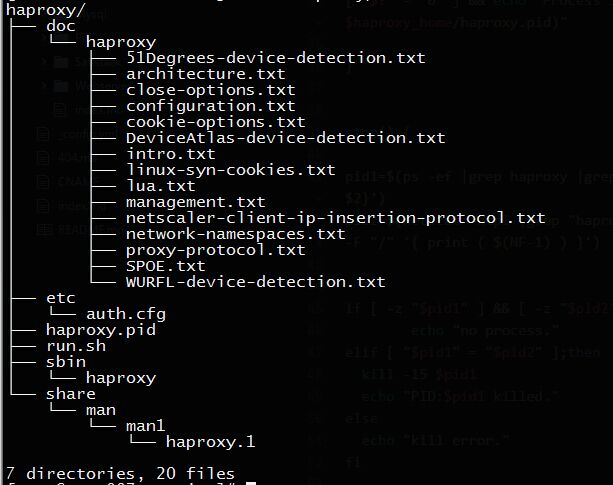

# haproxy安装配置一

## 1.安装
  - 源码安装

```bash
#!/bin/bash
#一键安装haproxy

kernel=$(echo "linux$(uname -r |cut -b 1-3|tr -d ".")")
arch=$(uname -a |awk '{print $(NF-1)}')
location="/usr/local/service/haproxy"

wget -O /tmp/haproxy-1.7.7.tar.gz http://www.haproxy.org/download/1.7/src/haproxy-1.7.7.tar.gz
tar zxf /tmp/haproxy-1.7.7.tar.gz -C /tmp
cd /tmp/haproxy-1.7.7
make  TARGET=$kernel ARCH=$arch PREFIX=$location  
make install PREFIX=/$location

```
 - 简易启动脚本
  > 安装完成后创建etc目录，创建配置文件auth.cfg

  > 

```bash
#!/bin/bash

start() {
haproxy_home="$(readlink -f $(dirname $0))"
haproxy_bin="$haproxy_home/sbin/haproxy"
haproxy_conf="$haproxy_home/etc/auth.cfg"

$haproxy_bin -f $haproxy_conf

[ "$?" = "0" ] && echo "Process Start,Pid:$(cat $haproxy_home/haproxy.pid)"

}


stop() {

pid1=$(ps -ef |grep haproxy |grep -v grep |awk '{print $2}')
pid2=$(netstat -ntpl |grep "haproxy"|awk '{print $NF}'|awk -F "/" '{ print ( $(NF-1) ) }')


if [ -z "$pid1" ] && [ -z "$pid2"] ;then
        echo "no process."
elif [ "$pid1" = "$pid2" ];then
	kill -15 $pid1
	echo "PID:$pid1 killed."
else
	echo "kill error."
fi

}


case $1 in
start)
start
;;
stop)
stop
;;
restart)
stop
start
;;
*)
stop
start
;;
esac

```


## auth.cfg 配置
