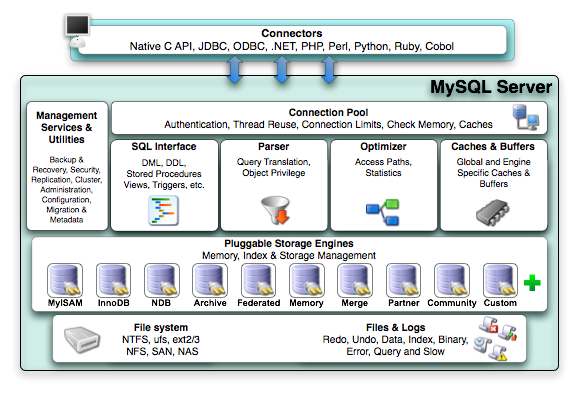

# Mysql概述及安装

## Mysql 特性
- mysql是一个关系型数据库管理系统
- 开源
- Client/Server 架构
- 性能高、可靠、可扩展、易于使用
> 


## 5.7特性
- innodb功能增强
- 安全性增强
- 支持json
- sys模式（性能数据收集）
- 多源复制
- 多线程复制
- 支持在线变更复制方式
- ...


## mysql 安装

- 三种mysql安装方式
```
1.软件包管理器安装
2.源码安装
3.二进制包安装（推荐使用：可以配置多实例，安装速度较源码安装快）
```

### 一、软件包管理器安装

##### CentOS：
```
下载地址：https://dev.mysql.com/downloads/repo/yum/
 rpm -Uvh mysql57-community-release-el7-11.noarch.rpm
 yum install mysql-community-server
 systemctl start mysqld.service
 systemctl status mysqld.service
```
##### Ubuntu：
```
下载地址：https://dev.mysql.com/downloads/repo/apt/
 sudo dpkg -i mysql-apt-config_0.8.8-1_all.deb
 sudo apt-get update
 sudo apt-get install mysql-server
 sudo service mysql status
```
##### 获取默认随机密码并更新：
```
 grep 'temporary password' /var/log/mysqld.log
 mysql -uroot –p
 mysql> ALTER USER 'root'@'localhost' IDENTIFIED BY '123';
```
### 二、源码包编译安装
下载地址：https://dev.mysql.com/downloads/mysql/

系统要求：

1.安装GCC编译器

2.安装CMake构建框架

3.安装Boost C++库1.59.0版本（必须此版本）

#### 2.1安装依赖包
CentOS：
```
 yum install -y gcc gcc-c++ cmake bison ncurses-devel
```
Ubuntu：
```
 apt-get install -y gcc cmake bison ncurses-dev
```
#### 2.2安装MySQL
```
 tar zxvf mysql-boost-5.7.20.tar.gz
 tar zxvf mysql-5.7.20.tar.gz
 cd mysql-5.7.20
 cmake \
-DMAKE_INSTALL_PREFIX=/usr/local/mysql \
-DSYSCONFDIR=/usr/local/mysql/etc \
-DMYSQL_DATADIR=/usr/local/mysql/data \
-DMYSQL_TCP_PORT=3306 \
-DEFAULT_CHARSET=utf8 \
-DEFAULT_COLLATION=utf8_general_ci \
-DMYSQL_UNIX_ADDR=/tmp/mysql.sock \
-DWITH_BOOST=./boost \
-DWITH_SYSTEMD=1
 make -j 4
 make install
```
#### 2.3初始化数据
```
 useradd -M -s /sbin/nologin mysql
 cd /usr/local/mysql
 bin/mysqld --initialize --basedir=/usr/local/mysql --datadir=/usr/local/mysql/data --user=mysql
 chown mysql -R .
```

### 三、二进制包安装

下载地址：https://dev.mysql.com/downloads/mysql/
#### 3.1安装依赖包

##### CentOS：
```
 yum install libaio
```
##### Ubuntu：
```
 apt-get install libaio1
```

#### 3.2初始化数据
```
 useradd -M -s /sbin/nologin mysql
 tar zxvf mysql-5.7.20-linux-glibc2.12-x86_64.tar.gz
 mv mysql-5.7.20-linux-glibc2.12-x86_64 /usr/local/mysql
 cd /usr/local/mysql
 bin/mysqld --initialize --basedir=/usr/local/mysql/ --datadir=/usr/local/mysql/data --user=mysql
 chown –R mysql .
```
#### 3.3创建配置文件
> vi my.cnf
```
[mysqld]
daemonize = on
user = mysql
port = 3306
basedir = /usr/local/mysql
datadir = /usr/local/mysql/data
socket = /tmp/mysql.sock
pid-file = /var/run/mysqld/mysqld.pid
character-set-server = utf8
collation-server = utf8_general_ci
max_connections = 1024
log-error = /var/log/mysqld.log
```


#### 3.4systemd管理MySQL服务
```
# vi /usr/lib/systemd/system/mysqld.service
[Unit]
Description=MySQL Server
Documentation=man:mysqld(8)
Documentation=http://dev.mysql.com/doc/refman/en/using-systemd.html
After=network.target
After=syslog.target
[Service]
User=mysql
Group=mysql
Type=forking
TimeoutSec=0
PermissionsStartOnly=true
ExecStart=/usr/local/mysql/bin/mysqld --defaults-file=/usr/local/mysql/etc/my.cnf
LimitNOFILE = 5000
Restart=on-failure
RestartPreventExitStatus=1
PrivateTmp=false
[Install]
WantedBy=multi-user.target
# systemctl start mysqld
# systemctl status mysqld
```
#### 3.5获取默认随机密码并更新
```
 mysql -uroot –p
 mysql> ALTER USER 'root'@'localhost' IDENTIFIED BY 'MyNewPass6';
```

## mysql 多实例

mysql多实例不同之处

1.数据目录

2.端口

3.Socket文件

4.Pid文件

### 1.安装MySQL
  > 使用源码和二进制包安装方式安装。

### 2.初始化目录
```
 bin/mysqld --initialize --basedir=/usr/local/mysql/ --datadir=/usr/local/mysql/data1 --user=mysql
 bin/mysqld --initialize --basedir=/usr/local/mysql/ --datadir=/usr/local/mysql/data2 --user=mysql
 bin/mysqld --initialize --basedir=/usr/local/mysql/ --datadir=/usr/local/mysql/data3 --user=mysql
```
